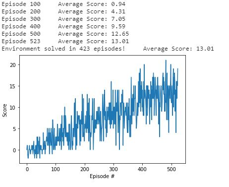

# Banana Collector Report

This report describes the details of the learning algorithm, its implementation, along with ideas for future work.

The high-level steps taken in training an agent following the '<Banana_Collector.ipynb>'

* Step 1: Importing packages and the Unity environment
* Step 2: Evaluate the state and action space
* Step 3: Establish baseline using a random action policy. 
* Step 4: Implement learning DQN algorithm: 
	* Initialize the replay memory
	* Initialize action-value function with random weights
	* Initialize target action-value weights
	* Choose an action using epsilon-greedy methods
	* Perform an action
	* Measure reward	
	* Prepare next state and store experience tuple
	* Obtain random minibatch of tuples
	* Set target and update 
The task is episodic, and in order to solve the environment, the agent must get an average score of +13 over 100 consecutive episodes
* Step 5: Loading the trained model into the environment to watch it perform

### Learning Algorithm & Code Structure :

The structure of how this repository was impleted is derived from the "Lunar Lander" repo from the Deep Reinforcement Learning Nanodegree, and has been adjusted for the purpose of this project. 

The code consist of :

* model.py : Here is where the Actor policy model is implemented with PyTorch and QNetwork class. There are two fully connected Deep Neural Network using the PyTorch Framework. It uses a forward neural netowrk architecture with reLu activation functions: '<fc1_units=256, fc2_units=128>.'

* dqn_bnagent.py : Here is where the learning algorithm is implemented: 
	* Initialize an agent object
	* Return actions for given state as per current policy
	* Update value parameters using given batch of experience tuples or model parameters
	* Initialize a ReplayBuffer
	* Randomly sample a batch of experiences from memory

You will start by specifying the Hyperparameters:
```
BUFFER_SIZE = int(1e5)  # replay buffer size
BATCH_SIZE = 64         # minibatch size
GAMMA = 0.99            # discount factor
TAU = 1e-3              # for soft update of target parameters
LR = 5e-4               # learning rate 
UPDATE_EVERY = 4        # how often to update the network 
```
In ```class Agent():``` you will have:

the _init_ function to interact and learn from the environment, this function will call the QNetwork class from model.py

``` 
def __init__(self, state_size, action_size, seed):
        self.state_size = state_size
        self.action_size = action_size
        self.seed = random.seed(seed)

        self.qnetwork_local = QNetwork(state_size, action_size, seed).to(device)
        self.qnetwork_target = QNetwork(state_size, action_size, seed).to(device)
        self.optimizer = optim.Adam(self.qnetwork_local.parameters(), lr=LR)

        self.memory = ReplayBuffer(action_size, BUFFER_SIZE, BATCH_SIZE, seed)
        # Initialize time step (for updating every UPDATE_EVERY steps)
        self.t_step = 0       
```
the _step_ function to learn at every time step and save experience in replay memory
```
    def step(self, state, action, reward, next_state, done):
        self.state_size = state_size
        self.action_size = action_size
        self.seed = random.seed(seed)


        # Q-Network
        self.qnetwork_local = QNetwork(state_size, action_size, seed).to(device)
        self.qnetwork_target = QNetwork(state_size, action_size, seed).to(device)
        self.optimizer = optim.Adam(self.qnetwork_local.parameters(), lr=LR)

        # Replay memory
        self.memory = ReplayBuffer(action_size, BUFFER_SIZE, BATCH_SIZE, seed)
        # Initialize time step (for updating every UPDATE_EVERY steps)
        self.t_step = 0
    
    def step(self, state, action, reward, next_state, done):
        # Save experience in replay memory
        self.memory.add(state, action, reward, next_state, done)
        
        # Learn every UPDATE_EVERY time steps.
        self.t_step = (self.t_step + 1) % UPDATE_EVERY
        if self.t_step == 0:
            # If enough samples are available in memory, get random subset and learn
            if len(self.memory) > BATCH_SIZE:
                experiences = self.memory.sample()
                self.learn(experiences, GAMMA)

```
the _act_ function that will return actions for given state as per current policy and implemente the epsilon-greedy action selection
```
    def act(self, state, eps=0.):

        state = torch.from_numpy(state).float().unsqueeze(0).to(device)
        self.qnetwork_local.eval()
        with torch.no_grad():
            action_values = self.qnetwork_local(state)
        self.qnetwork_local.train()

        # Epsilon-greedy action selection
        if random.random() > eps:
            return np.argmax(action_values.cpu().data.numpy())
        else:
            return random.choice(np.arange(self.action_size))

```
the _learn_ function to update value parameters and compute targets for current states, minimize losses and update target network
```
    def learn(self, experiences, gamma):

        states, actions, rewards, next_states, dones = experiences
 
        # Get max predicted Q values (for next states) from target model
        Q_targets_next = self.qnetwork_target(next_states).detach().max(1)[0].unsqueeze(1)
        # Compute Q targets for current states
        Q_targets = rewards + (gamma * Q_targets_next * (1 - dones))

        # Get expected Q values from local model
        Q_expected = self.qnetwork_local(states).gather(1, actions)

        # Compute loss
        loss = F.mse_loss(Q_expected, Q_targets)

        # Minimize the loss
        self.optimizer.zero_grad()
        loss.backward()
        self.optimizer.step()

        # ------------------- update target network ------------------- #
        self.soft_update(self.qnetwork_local, self.qnetwork_target, TAU)               
```
the _soft_ function updates the value from the target Neural Network from the local network weights (That's part of the Fixed Q Targets technique)

```
        for target_param, local_param in zip(target_model.parameters(), local_model.parameters()):
            target_param.data.copy_(tau*local_param.data + (1.0-tau)*target_param.data)

```

In ```class ReplayBuffer():``` you will implement a fixed-size buffer to store experience tuples and it will allow to add an experience step to the memory and to  to randomly sample a batch of experience steps for the learning:

```
    def __init__(self, action_size, buffer_size, batch_size, seed):

        self.action_size = action_size
        self.memory = deque(maxlen=buffer_size)  
        self.batch_size = batch_size
        self.experience = namedtuple("Experience", field_names=["state", "action", "reward", "next_state", "done"])
        self.seed = random.seed(seed)
    
    def add(self, state, action, reward, next_state, done):
        """Add a new experience to memory."""
        e = self.experience(state, action, reward, next_state, done)
        self.memory.append(e)
    
    def sample(self):
        """Randomly sample a batch of experiences from memory."""
        experiences = random.sample(self.memory, k=self.batch_size)

        states = torch.from_numpy(np.vstack([e.state for e in experiences if e is not None])).float().to(device)
        actions = torch.from_numpy(np.vstack([e.action for e in experiences if e is not None])).long().to(device)
        rewards = torch.from_numpy(np.vstack([e.reward for e in experiences if e is not None])).float().to(device)
        next_states = torch.from_numpy(np.vstack([e.next_state for e in experiences if e is not None])).float().to(device)
        dones = torch.from_numpy(np.vstack([e.done for e in experiences if e is not None]).astype(np.uint8)).float().to(device)
  
        return (states, actions, rewards, next_states, dones)

    def __len__(self):
        """Return the current size of internal memory."""
        return len(self.memory)
```

Note that additional comment is found in the python code. 

* Banana_Collector.ipynb : This Jupyter notebooks allows to import packages, examine environment, take random actions, train the agent using DQN, visualize in unity when agents are training and after training, and the training performance in a plot. 

### Performance of the agent
The following parameters were set: eps_start=1.0, eps_end=0.01 and eps_decay=0.995. 


### Ideas for Future Work
* Implementation of Double DQN, Dueling DQN, and Prioritized Experience Replay
* Modify NN Architecture by trying different layers or activation functions